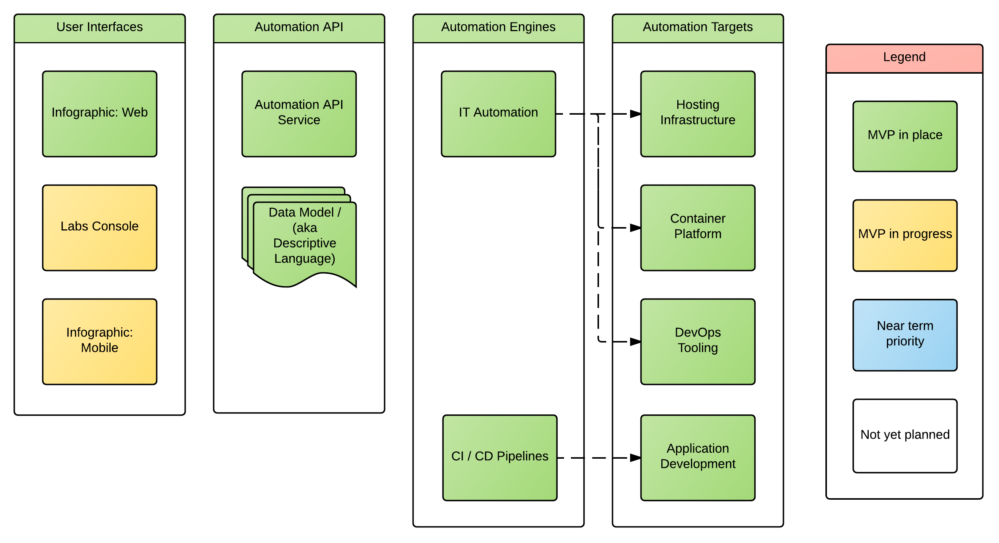

# What's In This Repository?
This repository is home to the Automation API specification for Open Innovation Labs Push Button Infrastructure. Originally, it started as the home of all our Swagger / OpenAPI Specifications, System Designs and Documentation, but over time we've decided that we should have smaller, more discrete repos. The repository needs to be migrated to a new one to make the name more declarative.

# What is Push Button Infrastructure (PBI)?

Push Button Infrastructure is a capability developed in the Open Innovation Lab to enable our participant to focus on feature development on day 1, not the details of the platform they are running. To help understand PBI at a conceptual level, we'll explore it using [bounded contexts](http://martinfowler.com/bliki/BoundedContext.html), a key modelling concept introduced in [domain driven design](https://www.amazon.com/Domain-Driven-Design-Tackling-Complexity-Software/dp/0321125215). In order to keep things conceptual, we're not going to introduce the tools or technologies we use for PBI implementation. There are 4 bounded contexts in the PBI conceptual architecture:

* **User Interfaces**
  * Graphical frontends to the assets in the PBI ecosystem, built using a [backend for frontend approach](https://www.thoughtworks.com/insights/blog/bff-soundcloud)
  * Repositories include:
    * https://github.com/rht-labs/labs-console
    * https://github.com/rht-labs/labs-console-api
    * https://github.com/rht-labs/infographic
* **Automation API**
   * A declarative contract for modelling the desired state of __Automation Targets__
   * This repository is used for the __Automation API__
* **Automation Engines**
   * Tools used to consume the __Automation API__ contract and produce the desired state in __Automation Targets__
   * Repositories include:
     * https://github.com/rht-labs/ansible-stacks
     * https://github.com/rht-labs/dynamic-pipeline-jenkins-plugin
     * https://github.com/rht-labs/openshift-jenkins-s2i-config
     * https://github.com/rht-labs/rhc-ose
* **Automation Targets**
  * The technologies that we ultimately want to create/configure/provision/etc. with PBI
  * We have the following types of automation targets:
     * Hosting Infrastructure (e.g. OpenStack, AWS)
     * Container Platform (e.g. OpenShift)
     * DevOps and Collaboration tools (e.g. Jira, Slack, GitHub, Jenkins)
     * Application Development (e.g. Maven builds, OpenShift s2i)

Here's how those contexts look graphically:

# Why build the Automation API?

The IT Automation and CI / CD tooling ecosystems are exploding. There is no one tool to rule them all

The current swagger.yaml file defines the automation API used throughout Open Innovation Labs. Over time it is likely that we'll model multiple APIs in this repository, and move Automation to a sub directory.

# An Example

## Code Generation
The code-gen folder contains scripts and helpers to generate the code we need from these APIs. For now, the scripts need to be run in the code-gen directory else they will fail.